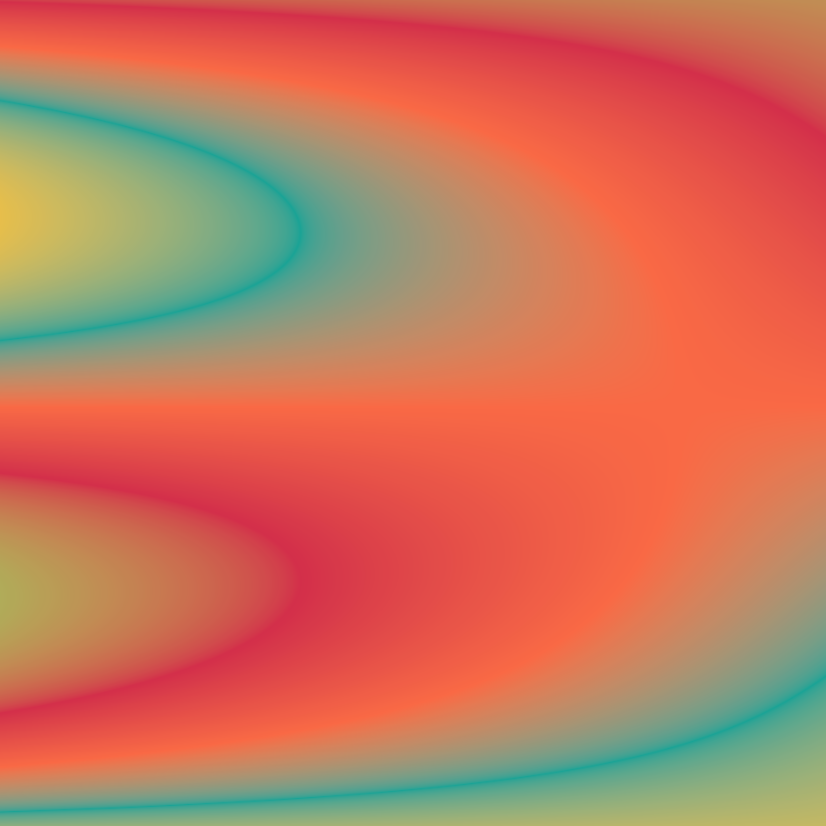
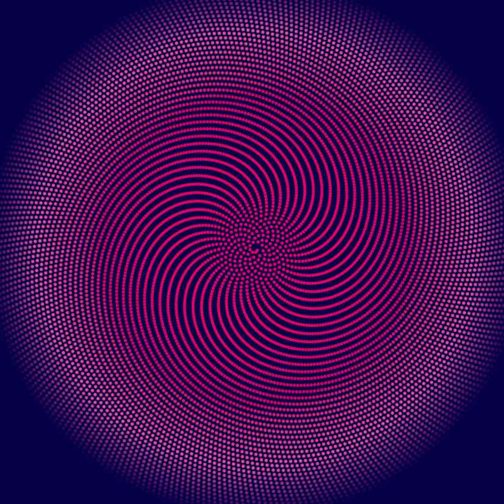

<!-- Artwork 1 -->
<html>

<head>
    
</head>
  
<body>
    <figure>
        
        <figcaption>
            <h3>Sunset</h3>
        </figcaption>
    </figure>
</body>
  
</html>

<!-- Artwork 2 -->
<html>
  
<head>
    
</head>
  
<body>
    <figure>
        
        <figcaption>
            <h3>Eye of the Bison: a Bucknell-inspired piece</h3>
        </figcaption>
    </figure>
</body>
  
</html>

<!-- Artwork 3 -->
<html>
  
<head>
    
</head>
  
<body>
    <figure>
        
        <figcaption>
            <h3>Sunflower</h3>
        </figcaption>
    </figure>
</body>
  
</html>
