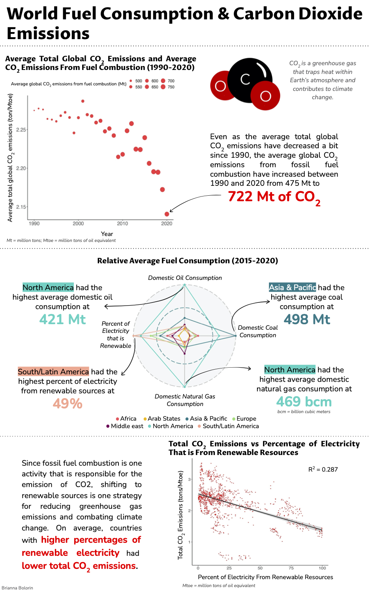

```{r setup, include=FALSE}
knitr::opts_chunk$set(echo = FALSE)
```


```{r, echo = FALSE, eval = FALSE}
library(ggplot2)
library(ggradar)


# Cleaning the data set

# Changing column names
colnames(energy) = c("country", "Year", "Region", "co2_fuel_com", "avg_co2",
                     "co2_gdp", "tot_energy_prod", "tot_energy_con", "perc_renew",
                     "elec_demand", "oil_dom_con", "ref_oil_prod", "gas_prod",
                     "gas_dom_con", "con_gdp", "elec_prod", "elec_dom_con", 
                     "coal_dom_con", "perc_wind_sol", "crud_oil_prod", "coal_prod")

# Converting variables to appropriate class
# Making region a factor
energy$Region = factor(energy$Region, 
                       levels = c("Arab States", "South/Latin America", 
                                  "Asia & Pacific", "Europe", "North America",
                                  "Middle east", "Africa"))
# Making numeric vectors
energy$gas_prod = as.numeric(energy$gas_prod)
energy$coal_dom_con = as.numeric(energy$coal_dom_con)
energy$perc_wind_sol = as.numeric(energy$perc_wind_sol)
energy$coal_prod = as.numeric(energy$coal_prod)

# Considering only complete cases
energy = energy[complete.cases(energy), ]


# Recent data
recent_data = energy[energy$Year >= 2015 & energy$Year <= 2020, ]
```


```{r, eval = FALSE, echo = FALSE}
region.name <- c("Africa", "Arab States", "Asia & Pacific",
                                 "Europe", "Middle east", "North America",
                                 "South/Latin America")


# OIL DATA
info.oil = NULL
for(y in 1:7){
    info.oil[y] = mean(recent_data$oil_dom_con[recent_data$Region == region.name[y]])
}

info.oil = info.oil/max(info.oil)


# COAL DATA
info.coal = NULL
for(y in 1:7){
  info.coal[y] = mean(recent_data$coal_dom_con[recent_data$Region == region.name[y]])
}

info.coal = info.coal/max(info.coal)


# GAS DATA
info.gas = NULL
for(y in 1:7){
  info.gas[y] = mean(recent_data$gas_dom_con[recent_data$Region == region.name[y]])
}

info.gas = info.gas/max(info.gas)


# RENEW DATA
info.renew = NULL
for(y in 1:7){
  info.renew[y] = mean(recent_data$perc_renew[recent_data$Region == region.name[y]])
}

info.renew = info.renew/max(info.renew)


# RADAR DF
radar.info = data.frame(Region = region.name,
                        info.oil = info.oil,
                        info.coal = info.coal,
                        info.gas = info.gas,
                       info.renew = info.renew)

ggradar(radar.info, group.line.width = .5, group.point.size = 1,
         grid.label.size = 0, axis.label.size = 3, axis.labels = c("Domestic Oil Consumption",
                         "Domestic
 Coal
 Consumption",
                         "Domestic Natural Gas",
 "Percent of Renewable
 Electricity")) +
   theme(legend.text = element_text(size = 9),
         plot.title = element_text(size = 13)) +
   ggtitle("Comparison of Relative Average Fuel 
           Consumption (2015-2020)")

radar.info

```


```{r, eval = FALSE, echo = FALSE}
renew_info <- 
  ggplot(energy, aes(x = perc_renew, y = avg_co2)) +
  geom_point(size = 0.5, color = "red") +
  theme_classic() +
  geom_smooth(method = "lm", linewidth = 1, color = "black") +
  scale_fill_brewer(palette = "Reds") +
  guides(alpha = "none") +
  labs(y = "Total CO2 emission (tons/Mtoe)",
       x = "Percent of total electricity production that is renewable",
       caption = "Mtoe = million tons of oil equivalent") +
  ggtitle("Total CO2 Emissions vs Percentage of Electiricity Production That is \n From Renewable Resources (1990-2020)") +
  theme(plot.caption = element_text(color = "#6B6B6B", face = "italic"),
        axis.text = element_text(size = 15),
         axis.title = element_text(size = 12),
         legend.text = element_text(size = 12),
         legend.title = element_text(size = 12))

cor(energy$perc_renew, energy$avg_co2)

(cor(energy$perc_renew, energy$avg_co2))^2


```


```{r, eval = FALSE, echo = FALSE}
year = c(1990:2020)

avg_tot_co2_global = NULL
for(i in 1:nrow(energy)){
  for(y in 1:31){
    avg_tot_co2_global[y] = mean(energy$avg_co2[energy$Year == year[y]])
  }
}

avg_co2_combust_global = NULL
for(i in 1:nrow(energy)){
  for(y in 1:31){
    avg_co2_combust_global[y] = mean(energy$co2_fuel_com[energy$Year == year[y]])
  }
}

# Plotting
co2_info <- ggplot() +
  theme_classic() +
 geom_point(aes(x = year, y = avg_tot_co2_global, size = avg_co2_combust_global), color = "red", alpha = 0.75) +
  labs(x = "Year",
       y = "Average total global CO2 emissions (ton/Mtoe)",
       size = "Average global CO2 emissions from fuel combustion (Mt)",
       caption = "Mtoe = million tons of oil equivalent") +
   ggtitle("Average Total Global CO2 Emissions and Average CO2 \n Emissions From Fuel Combustion (1990-2020)") +
   theme(plot.caption = element_text(color = "#6B6B6B", face = "italic"), legend.position = "top",
         axis.text = element_text(size = 15),
         axis.title = element_text(size = 12),
         legend.text = element_text(size = 12),
         legend.title = element_text(size = 12))

png("co2.png")
print(co2_info)
dev.off()


```




